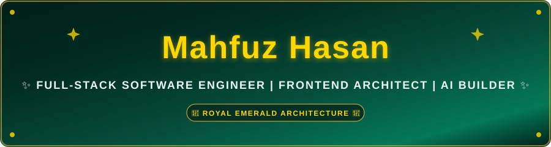

  <!-- 👑 1. Dedicated Animated Royal Emerald & Imperial Gold Banner (Zero Pink, High Contrast) -->
  

  <!-- ⌨️ 2. High-Contrast Terminal Typing SVG (Imperial Gold on Deep Emerald) -->
  

  <!-- 🏷️ 3. Quick Counter & Status Badges (Royal Emerald & Gold Palette) -->
  

    
    
    
    
    
  

<!-- ⚜️ Royal Emerald Animated Divider -->

---

##  About Me

<!-- 💻 4. High-Reliability Developer Coding Animation (Floated Right, No Blank Space, 100% Reliable) -->

Greetings! I am <strong>Mahfuz Hasan</strong>, an ambitious and precision-driven <strong>Full-Stack Software Engineer</strong> based in Bangladesh. I specialize in architecting modern client-side ecosystems, resilient backend microservices, and interactive algorithmic platforms.

My engineering philosophy centers on <strong>clean code</strong>, <strong>rigorous type safety</strong>, and <strong>sub-second performance</strong>. Whether translating business requirements into scalable Next.js architectures or implementing vector ballistic calculations on HTML5 canvas, I prioritize engineering excellence at every layer.

### ⚜️ Strategic Highlights & Current Initiatives:
- 🔭 **Core Engineering:** Architecting full-stack web applications with **Next.js**, **React**, and **TypeScript**.
- ⚡ **Strict Type Architecture:** Developing modular, strictly-typed frontends and reactive components in [`Assignment-6`](https://github.com/mahfuzhasan2700/Assignment-6).
- 🤖 **AI & Intelligent Systems:** Designing autonomous developer agents and modular pipeline workflows in [`Perseus_AI`](https://github.com/mahfuzhasan2700/Perseus_AI).
- 💰 **FinTech Solutions:** Engineering real-time personal wealth analytics and financial ledger tracking in [`Amar_Finance`](https://github.com/mahfuzhasan2700/Amar_Finance).
- 🎯 **Simulation Science:** Modeling 2D projectile dynamics and trigonometric firing vectors in [`artillery-laying-simulator`](https://github.com/mahfuzhasan2700/artillery-laying-simulator).
- 💬 **Core Discussions:** Web Architecture, Reactive State Management, TypeScript, Scalable UI/UX, Performance Tuning.
- 📫 **Direct Inquiries:** Reach me at [mahfuzhasan2700@gmail.com](mailto:mahfuzhasan2700@gmail.com) or connect on [LinkedIn](https://linkedin.com/in/mahfuzhasan2700).

 

<!-- ⚜️ Royal Emerald Animated Divider -->

---

## 🛠️ Tech Stack & Technical Arsenal

  
<b>✨ Interactive Tech Stack Matrix (Hover to Interact)</b>

  <!-- ⚡ 5. Interactive Skill Icons Matrix -->
  

 

<table width="100%">
  <tr>
    <td width="50%" valign="top">
      <h3 align="left">💻 Programming Languages</h3>
      

        
        
        
        
        
      

      <h3 align="left">🌐 Frontend Architecture & Design</h3>
      

        
        
        
        
        
      

    </td>
    <td width="50%" valign="top">
      <h3 align="left">⚙️ Backend & Architecture</h3>
      

        
        
        
        
      

      <h3 align="left">🧰 Developer Tools & DevOps</h3>
      

        
        
        
        
      

    </td>
  </tr>
</table>

<!-- ⚜️ Royal Emerald Animated Divider -->

---

## 🏛️ Featured Pinned Projects

<table width="100%">
  <thead>
    <tr align="left">
      <th width="32%">Repository & Overview</th>
      <th width="26%">Core Technologies</th>
      <th width="27%">Architectural Highlights</th>
      <th width="15%" align="center">Repository</th>
    </tr>
  </thead>
  <tbody>
    <tr>
      <td valign="top">
        <a href="https://github.com/mahfuzhasan2700/Assignment-6"><strong>⚡ Assignment-6</strong></a>
         
        High-performance interactive web application built with strict TypeScript types, modular UI hierarchy, and responsive layouts.
      </td>
      <td valign="middle">
        
        
      </td>
      <td valign="top">
        • Strict Type Definitions 
        • Modular Component State 
        • Responsive Pixel-Perfect UI
      </td>
      <td align="center" valign="middle">
        
      </td>
    </tr>
    <tr>
      <td valign="top">
        <a href="https://github.com/mahfuzhasan2700/Perseus_AI"><strong>🤖 Perseus_AI</strong></a>
         
        Intelligent automation toolkit and AI agent experimentation framework engineered for automated workflow acceleration.
      </td>
      <td valign="middle">
        
        
      </td>
      <td valign="top">
        • Autonomous Agent Loop 
        • Modular Tool Calling 
        • Workflow Orchestration
      </td>
      <td align="center" valign="middle">
        
      </td>
    </tr>
    <tr>
      <td valign="top">
        <a href="https://github.com/mahfuzhasan2700/Amar_Finance"><strong>💰 Amar_Finance</strong></a>
         
        Personal and commercial wealth tracking utility designed for real-time budgeting, ledger clarity, and expense visualization.
      </td>
      <td valign="middle">
        
        
      </td>
      <td valign="top">
        • Real-Time Ledger Computations 
        • Interactive Financial Analytics 
        • Zero-Lag State Updates
      </td>
      <td align="center" valign="middle">
        
      </td>
    </tr>
    <tr>
      <td valign="top">
        <a href="https://github.com/mahfuzhasan2700/artillery-laying-simulator"><strong>🎯 Artillery Laying Simulator</strong></a>
         
        Physics trajectory computation engine simulating projectile dynamics and vector math on an interactive HTML5 canvas.
      </td>
      <td valign="middle">
        
        
      </td>
      <td valign="top">
        • Ballistic Trajectory Formulas 
        • Real-Time 60FPS Animation 
        • Vector & Angle Calculations
      </td>
      <td align="center" valign="middle">
        
      </td>
    </tr>
    <tr>
      <td valign="top">
        <a href="https://github.com/mahfuzhasan2700/Portfolio-Website"><strong>🌐 Personal Portfolio Website</strong></a>
         
        Modern developer showcase featuring engineering projects, interactive skills matrix, and direct contact integration.
      </td>
      <td valign="middle">
        
        
        
      </td>
      <td valign="top">
        • Fully Responsive Mobile/Desktop 
        • Smooth Scroll & Animations 
        • Clean Semantic Layout
      </td>
      <td align="center" valign="middle">
        
      </td>
    </tr>
  </tbody>
</table>

<!-- ⚜️ Royal Emerald Animated Divider -->

---

## 📊 Live GitHub Analytics & Performance

  <!-- 📈 6. Live Dynamic Stats Cards (Custom Royal Emerald & Imperial Gold Theme) -->
  <table border="0">
    <tr>
      <td align="center" valign="middle">
        
      </td>
      <td align="center" valign="middle">
        
      </td>
    </tr>
  </table>

   

  <!-- 🔥 7. Animated Flame Streak Stats (Royal Emerald Background & Gold/Emerald Accents) -->
  

 

<!-- 🐍 8. 3D Contribution Grid Snake Animation (Theme Adaptive) -->

  <h3>🐍 GitHub Contribution Grid Eater</h3>
  <picture>
    <source media="(prefers-color-scheme: dark)" srcset="https://raw.githubusercontent.com/mahfuzhasan2700/mahfuzhasan2700/output/github-contribution-grid-snake-dark.svg">
    <source media="(prefers-color-scheme: light)" srcset="https://raw.githubusercontent.com/mahfuzhasan2700/mahfuzhasan2700/output/github-contribution-grid-snake.svg">
    
  </picture>

<!-- ⚜️ Royal Emerald Animated Divider -->

---

<!-- 💡 9. Animated Typewriter Motivational Quote -->

  
<b>💭 Engineering Philosophy</b>

  

---

## 📬 Connect & Collaborate

  
I am always receptive to engineering discussions, open-source collaborations, and high-impact software opportunities.

  

    
    
    
    
  

<!-- 👑 10. Dedicated Animated Royal Emerald & Imperial Gold Footer Banner -->

  

